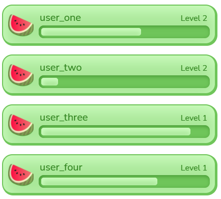
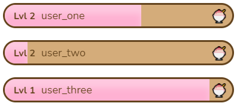

# Chat Leaderboard
A leaderboard to reward chat engagement!

## Features
Whenever someone sends a message, they gain XP. With enough XP they can level up, and users with the highest levels are shown off on the leaderboard!

There are many layers of customization, including:
- Styling of all colors, shapes, and sizes
- Complete control over level scaling
- Various different layouts
- And more!

## Demo
Video: https://youtu.be/Cdr-FcjS_RU

## Themes
Here are some pre-built themes that you can import into your Chat Leaderboard!
### Theme Import Tutorial
1. Click one of the **theme data** links below
1. Copy everything there
1. Go to your **Chat Leaderboard** widget
1. Open **Settings** > **Theme Import/Export**
1. Paste into the field **under** the **Import Theme** button
1. Click the **Import Theme** button
1. It should now say **"Import Successful!"** under the button
1. Scroll up to **Preview** and click the **Toggle Preview** button to see the theme!

### Melon (Default Theme)
[Melon Theme Data](themes/melon.json?raw=true)

### Twitch
[Twitch Theme Data](themes/twitch.json?raw=true)

### Hibiscus
[Hibiscus Theme Data](themes/hibiscus.json?raw=true)

### Ice Cream
[Ice Cream Theme Data](themes/icecream.json?raw=true)

### Frog
[Frog Theme Data](themes/frog.json?raw=true)

## Theme Import Tutorial
> This will override all style settings
1. Click one of the **theme data** links above
1. Copy all of the code in that file
1. Go to and edit your **StreamElements** overlay that has the **Chat Leaderboard** widget
1. In the **StreamElements Overlay Editor**, select the **Chat Leaderboard** widget
1. Open **Settings** on the left
1. Click **OPEN EDITOR** at the top of the **Settings** menu
1. Select the **DATA** tab
1. Delete everything in the **DATA** tab, and paste the code you copied from the **theme data** file
1. Click **DONE**, and the theme should be loaded in!

