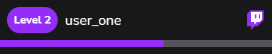
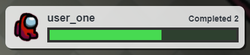

# Chat Leaderboard Themes
Here are some pre-built themes that you can import into your Chat Leaderboard!

## Theme Import Tutorial
1. Click one of the **theme data** links below
1. Copy everything there
1. Go to your **Chat Leaderboard** widget
1. Open **Settings** > **Theme Import/Export**
1. Paste into the field **under** the **Import Theme** button
1. Click the **Import Theme** button
1. It should now say **"Import Successful!"** under the button
1. Scroll up to **Preview** and click the **Toggle Preview** button to see the theme!

## Melon (Default Theme)
[Melon Theme Data](melon/theme.json?raw=true)

## Twitch
[Twitch Theme Data](twitch/theme.json?raw=true)

## Hibiscus
[Hibiscus Theme Data](hibiscus/theme.json?raw=true)

## Ice Cream
[Ice Cream Theme Data](icecream/theme.json?raw=true)

## Frog
[Frog Theme Data](frog/theme.json?raw=true)

## Beach
[Beach Theme Data](beach/theme.json?raw=true)

## Sus
[Sus Theme Data](sus/theme.json?raw=true)

## Cotton Candy
[Cotton Candy Theme Data](cottoncandy/theme.json?raw=true)

